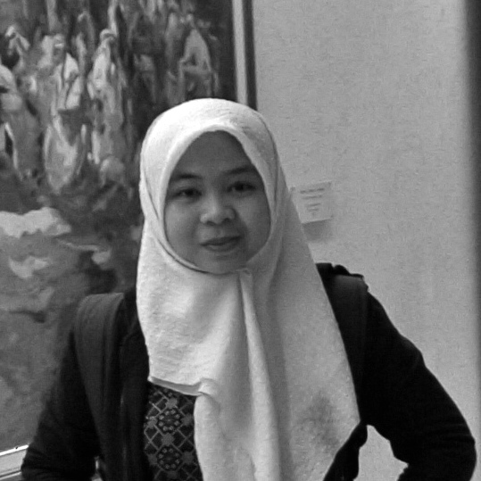

---
# You don't need to edit this file, it's empty on purpose.
# Edit theme's home layout instead if you wanna make some changes
# See: https://jekyllrb.com/docs/themes/#overriding-theme-defaults
layout: splash
author_profile: false
title: The First Workshop in South East Asian Language Processing
excerpt: |
  Co-located with [AACL 2023](http://www.ijcnlp-aacl2023.org), Bali
   
  1st November 2023
header:
  overlay_image: /assets/images/header.jpg
  overlay_filter: 0.5 # same as adding an opacity of 0.5 to a black background
  caption: "Photo credit: [**Pexels**](https://www.pexels.com/@stijn-dijkstra-1306815/)"

---

South East Asia is one of the most linguistically diverse regions in the world, with over 1200 languages spoken by 680 million people. However, the diversity of South East Asian languages has long been at risk due to the emphasis on national languages as lingua franca in South East Asian countries at the end of colonization; and the increasing prominence of English due to the necessities of globalization. 

This workshop will bring together practitioners from academia, government, and industry interested in the research and development of language technologies for SEA languages. The workshop also aims to build an inclusive community of everyone passionate about SEA languages, increase community awareness of works that have been developed to date on these languages, and foster collaborations that will strengthen and spur NLP research and development in SEA languages. 

## Topics

We welcome archival and non-archival submissions in NLP and speech approaches to South East Asian language (See [Call for Paper](https://sealp-workshop.github.io/calls) for more details). 

| Important Dates |  |
| :---  | :--- |
| Submission Deadline | 25th August 2023 |
| Acceptance Notification |  2023 |
| Camera-Ready Deadline | x Y 2023 |
| Workshop | 1st November 2023 |

## Organizers

<table border="0" style="width:100%">
    <tbody>
        <tr>
            <td width="20%"></td>
            <td width="20%"></td>
            <td width="20%"></td>
            <td width="20%"></td>
            <td width="20%"></td>
        </tr>
        <tr>
            <td style="text-align:center"><a href="https://derrywijaya.github.io/web/">Derry Wijaya</a></td>
            <td style="text-align:center"><a href="https://derrywijaya.github.io/web/">Alham Fikri Aji</a></td>
            <td style="text-align:center"><a href="https://derrywijaya.github.io/web/">Clara Vania</a></td>
            <td style="text-align:center"><a href="https://derrywijaya.github.io/web/">Genta Indra Winata</a></td>
            <td style="text-align:center"><a href="https://derrywijaya.github.io/web/">Ayu Purwarianti</a></td>
        </tr>
          <tr>
            <td style="text-align:center">Monash Indonesia</a></td>
            <td style="text-align:center">MBZUAI</td>
            <td style="text-align:center">Amazon</td>
            <td style="text-align:center">Bloomberg</td>
            <td style="text-align:center">Institut Teknologi Bandung</td>
        </tr>
    </tbody>
</table>
